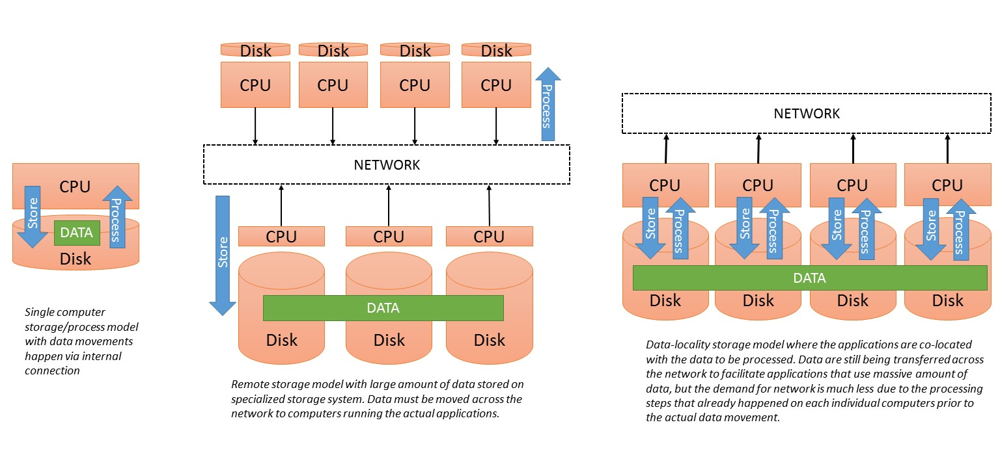
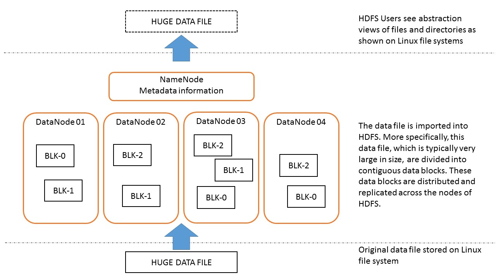
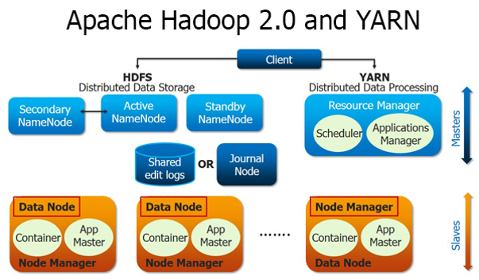

> ## Overview
> - 2002: Doug Cutting and Mike Carafella started a project to build an open-source search engine called 
> Nutch. A component of this project was a web crawler that can crawl and index the Internet.
> - 2003: Google released a research paper on its in-house data storage system called Google File System 
> (GFS).
> - 2004: Google released another research paper on the programming approach to process data stored on 
> GFS, called MapReduce.
> - 2005: Cutting and Carafelle rebuilt the underlying file management system and processing framework of 
> Nutch based on the architectural design of Google's GFS and MapReduce.
> - 2006: The adaptations of Google's GFS and MapReduce are converted into a single open source project 
> called Hadoop, which is sponsored by Yahoo and led by Doug Cutting.
> - 2007: Yahoo maintains a 1000-node production cluster.
> - 2008: Hadoop becomes the platform of Yahoo's web index. Hadoop wins record for world fastest system 
> to sort one terabyte of data (209 seconds using a 910-node cluster). Hadoop becomes a top-level open 
> source project of Apache Foundation. First Hadoop commercial distributor led by a former Google 
> employee, Cloudera, is founded.
> - 2009: Hadoop sorts one terabyte of data in 62 seconds and one petabyte of data in 16.25 hours using a 
> 3800-node cluster. Second Hadoop commercial distributor, MapR, is formed.
> - 2011: Yahoo spins off its own Hadoop comnmercial distributor, Hortonworks.
> - 2012: Apache Hadoop 1.0 is released.
{: .slide}

> ## Corresponding Project Names
> - Google File Systems (GFS): Hadoop Distributed File System (HDFS)
> - Google MapReduce: Hadoop MapReduce
> - Google BigTable: Apache HBase
{: .slide}

> ## Corresponding Component Names for GFS/HDFS
> - GFS Master: NameNode
> - Chunkserver: DataNode
> - Chunks: Blocks
{: .slide}

> ## Apache Hadoop Project
> - Hadoop Distributed File System
> - YARN (Yet Another Resource Negotiator)
> - Hadoop MapReduce
> - Hadoop Distributed File Systems
{: .slide}

> ## Design Assumptions and Goals
> - Hardware failure is the norm rather than the exception
> - Streaming data access
>   - Not for general purpose applications
>   - For batch processing rather than interactive use
>   - For high throughput of data access rather than low latency of data access
> - Large data sets (terabytes in size) 
>   - *This is relative. Sometimes files as small as hundreds of megabytes can also take advantage of 
Hadoop's data and computation parallelism.*
> - Simple coherency model (write once read many)
> - Moving computation is cheaper than moving data
> - Portability across heterogeneous hardware and software platform
{: .slide}

> ## HDFS Architecture
> 
> 
{: .slide}

> ## Comparing File System Models
> 
> 
{: .slide}

> ## Hadoop 2.0: YARN (Yet Another Resource Negotiator)
> - Pure scheduler: limited to arbitrating available resources in the system
> - Pluggable scheduler: multiple scheduling algorithms
> - Job management is handle by ApplicationMaster
> 
{: slide}


