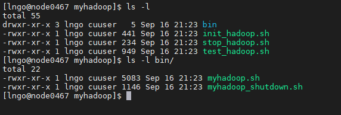
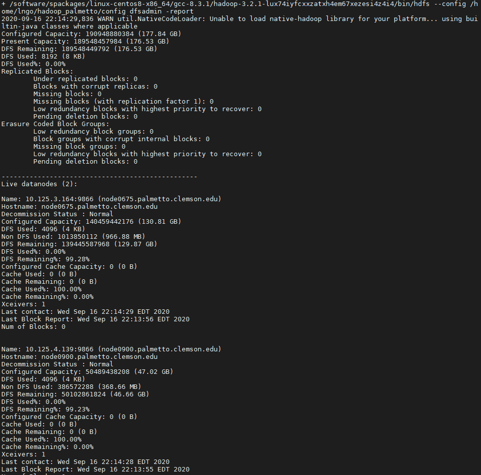
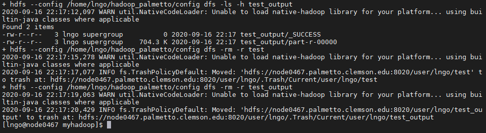
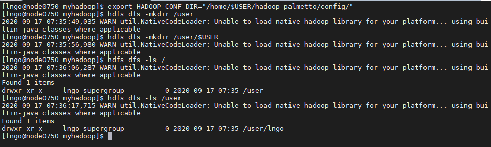

> ## Updating .bashrc
> 
> - Run the following command
>
> ~~~
> $ echo "module load openjdk/1.8.0_222-b10-gcc/8.3.1 hadoop/3.2.1-gcc/8.3.1" >> ~/.bashrc
> ~~~
> {: language-bash}
{: .slide}

> ## Requesting resources
>
> ~~~
> $ qsub -I -l select=3:ncpus=8:mem=14gb,walltime=03:30:00
> ~~~
> {: .language-bash}
{: .slide}

> ## Copying the myhadoop template from /zfs/citi
>
> - After request is granted
>
> ~~~
> $ cp -R /zfs/citi/myhadoop/ ~/
> $ cd ~/myhadoop
> ~~~
> {: .language-bash}
{: .slide}

> ## Examining the myhadoop template
>
> ~~~
> $ ls -l
> $ ls -l bin/
> ~~~
> {: .language-bash}
>
> 
>
> - `init_hadoop.sh`: format and launch a new Hadoop cluster on the allocated resources. 
> - `test_hadoop.sh`: quickly test the newly launched cluster.
> - `stop_hadoop.sh`: stop the Hadoop cluster and clean up all data storage.
> - `bin/myhadoop.sh`: launch all components of Hadoop. 
> - `bin/myhadoop_shutdown.sh`: stop all components of Hadoop. 
{: .slide}

> ## Launching myhadoop
>
> ~~~
> $ ./init_hadoop.sh
> ~~~
> {: .language-bash}
>
> The final command in `init_hadoop.sh` will show the results of a system check. A successful
> launch will show the number of live data nodes being one less than the total number of nodes
> requested from Palmetto. 
>
> 
{: .slide}

> ## Testing myhadoop
>
> ~~~
> $ ./test_hadoop.sh
> ~~~
> {: .language-bash}
>
> A succesful test will show the completed run of the test WordCount program
>
> 
{: .slide}

> ## Hadoop main commands
> 
> Users can interact with Hadoop via command and subcommand. The primary command to interact
> with Hadoop is `hdfs`. A subcommand related to file system operations is `dfs`. Entering these
> commands without parameters will give you the usage. 
> 
> ~~~
> $ hdfs
> $ hdfs dfs
> ~~~
> {: .language-bash}
{: .slide}

> ## Specifying configuration location
> 
> We need to specify the location of the configuration files for our hadoop cluster. This
> can be done by setting the `HDAOOP_CONF_DIR` environment variable. 
>
> ~~~
> $ export HADOOP_CONF_DIR="/home/$USER/hadoop_palmetto/config/"
> $ hdfs dfs -mkdir /user/
> $ hdfs dfs -mkdir /user/$USER
> $ hdfs dfs -ls /user/
> $ hdfs dfs -ls /user/$USER
> ~~~
> {: language-bash}
>
> 
{: .slide}

> ## Challenge: creating a directory
> 
> Create a directory named `intro-to-hadoop` inside your user directory on HDFS. Confirm
> that the directory was successfully created. 
>
> > ## Solution: 
> > 
> > ~~~
> > $ hdfs dfs -mkdir /user/$USER/intro-to-hadoop
> > $ hdfs dfs -ls /user/$USER
> > ~~~
> > {: .language-bash}
> {: .solution}
{: .challenge}

> ## Home directory on HDFS
> 
> In HDFS, the home directory is defaulted to be `/user/$USER` with `$USER` is
> your username. 
>
> ~~~
> $ hdfs dfs -ls /user/$USER
> $ hdfs dfs -ls 
> $ hdfs dfs -ls .
> ~~~
> {: language-bash}
>
> 
{: .slide}

> ## Uploading and downloading data
> 
> To upload data into HDFS, we use the subsubcommand `put`. To download data from HDFS, 
> we use the subsubcommand `get`. 
>
> ~~~
> $ hdfs dfs -put /zfs/citi/complete-shakespeare.txt intro-to-hadoop/
> $ hdfs dfs -ls intro-to-hadoop
> $ hdfs dfs -head intro-to-hadoop/complete-shakespeare.txt
> ~~~
> {: .bash-language}
!hdfs --config ~/hadoop_palmetto/config dfs -put text intro-to-hadoop
 
Challenge
Check the health status of the directories above in HDFS using fsck:

hdfs fsck <path-to-directory> -files -blocks -locations
!hdfs --config ~/hadoop_palmetto/config fsck intro-to-hadoop/text/complete-shakespeare.txt -files -blocks -locations
MapReduce Programming Paradigm
What is “map”? – A function/procedure that is applied to every individual elements of a collection/list/array/…

int square(x) { return x*x;}
map square [1,2,3,4] -> [1,4,9,16]
What is “reduce”? – A function/procedure that performs an operation on a list. This operation will “fold/reduce” this list into a single value (or a smaller subset)

reduce ([1,2,3,4]) using sum -> 10
reduce ([1,2,3,4]) using multiply -> 24
MapReduce is an old concept in functional programming. It is naturally applicable in HDFS:

map tasks are performed on top of individual data blocks (mainly to filter and decrease raw data contents while increase data value
reduce tasks are performed on intermediate results from map tasks (should now be significantly decreased in size) to calculate the final results.
1. The Hello World of Hadoop: Word Count
!mkdir codes
!hdfs --config ~/hadoop_palmetto/config dfs -cat intro-to-hadoop/text/complete-shakespeare.txt \
    2>/dev/null | head -n 100
%%writefile codes/wordcountMapper.py
#!/software/spackages/linux-centos8-x86_64/gcc-8.3.1/anaconda3-2019.10-v5cuhr6keyz5ryxcwvv2jkzfj2gwrj4a/bin/python                                          
import sys                                                                                                
for oneLine in sys.stdin:
    oneLine = oneLine.strip()
    for word in oneLine.split(" "):
        if word != "":
            print ('%s\t%s' % (word, 1)) 
!hdfs --config ~/hadoop_palmetto/config dfs -cat intro-to-hadoop/text/complete-shakespeare.txt \
    2>/dev/null \
    | head -n 20 \
    | python ./codes/wordcountMapper.py
!hdfs --config ~/hadoop_palmetto/config dfs -cat intro-to-hadoop/text/complete-shakespeare.txt \
    2>/dev/null \
    | head -n 20 \
    | python ./codes/wordcountMapper.py \
    | sort
%%writefile codes/wordcountReducer.py
#!/software/spackages/linux-centos8-x86_64/gcc-8.3.1/anaconda3-2019.10-v5cuhr6keyz5ryxcwvv2jkzfj2gwrj4a/bin/python
import sys

current_word = None
total_word_count = 0

for line in sys.stdin:
    line = line.strip()
    word, count = line.split("\t", 1)
    try:
        count = int(count)
    except ValueError:
        continue
    
    if current_word == word:
        total_word_count += count
    else:
        if current_word:
            print ("%s\t%s" % (current_word, total_word_count))
        current_word = word
        total_word_count = 1
        
if current_word == word:
    print ("%s\t%s" % (current_word, total_word_count))
!hdfs --config ~/hadoop_palmetto/config dfs -cat intro-to-hadoop/text/complete-shakespeare.txt \
    2>/dev/null \
    | head -n 20 \
    | python ./codes/wordcountMapper.py \
    | sort \
    | python ./codes/wordcountReducer.py
!hdfs --config ~/hadoop_palmetto/config dfs -rm -R intro-to-hadoop/output-wordcount
!mapred --config ~/hadoop_palmetto/config streaming \
    -input intro-to-hadoop/text/complete-shakespeare.txt \
    -output intro-to-hadoop/output-wordcount \
    -file ./codes/wordcountMapper.py \
    -mapper wordcountMapper.py \
    -file ./codes/wordcountReducer.py \
    -reducer wordcountReducer.py
!hdfs --config ~/hadoop_palmetto/config dfs -ls intro-to-hadoop/output-wordcount
!hdfs --config ~/hadoop_palmetto/config dfs -cat intro-to-hadoop/output-wordcount/part-00000 \
    2>/dev/null | head -n 100
Challenge
Modify wordcountMapper.py so that punctuations and capitalization are no longer factors in determining unique words

%%writefile codes/wordcountEnhancedMapper.py
#!/software/spackages/linux-centos8-x86_64/gcc-8.3.1/anaconda3-2019.10-v5cuhr6keyz5ryxcwvv2jkzfj2gwrj4a/bin/python                                          
import sys                     
import string

translator = str.maketrans('', '', string.punctuation)

for oneLine in sys.stdin:
    oneLine = oneLine.strip()
    for word in oneLine.split(" "):
        if word != "":
            newWord = word.translate(translator).lower()
            print ('%s\t%s' % (_______, 1)) 
!hdfs dfs -rm -R intro-to-hadoop/output-wordcount-enhanced
!ssh dsciutil yarn jar /usr/hdp/current/hadoop-mapreduce-client/hadoop-streaming.jar \
    -input intro-to-hadoop/text/gutenberg-shakespeare.txt \
    -output intro-to-hadoop/output-wordcount \
    -file ____________________________________________________ \
    -mapper _____________________ \
    -file ____________________________________________________ \
    -reducer _____________________ \
This website does not host notebooks, it only renders notebooks available on other websites.

Delivered by Fastly, Rendered by OVHCloud

nbviewer GitHub repository.

nbviewer version: e83752b

nbconvert version: 5.6.1

Rendered an hour ago

> ## Copying the myhadoop template from /zfs/citi
> Is this a question?
> 
> > ## Solution
> > It is a question
> {: .solution}
{: .challenge}


